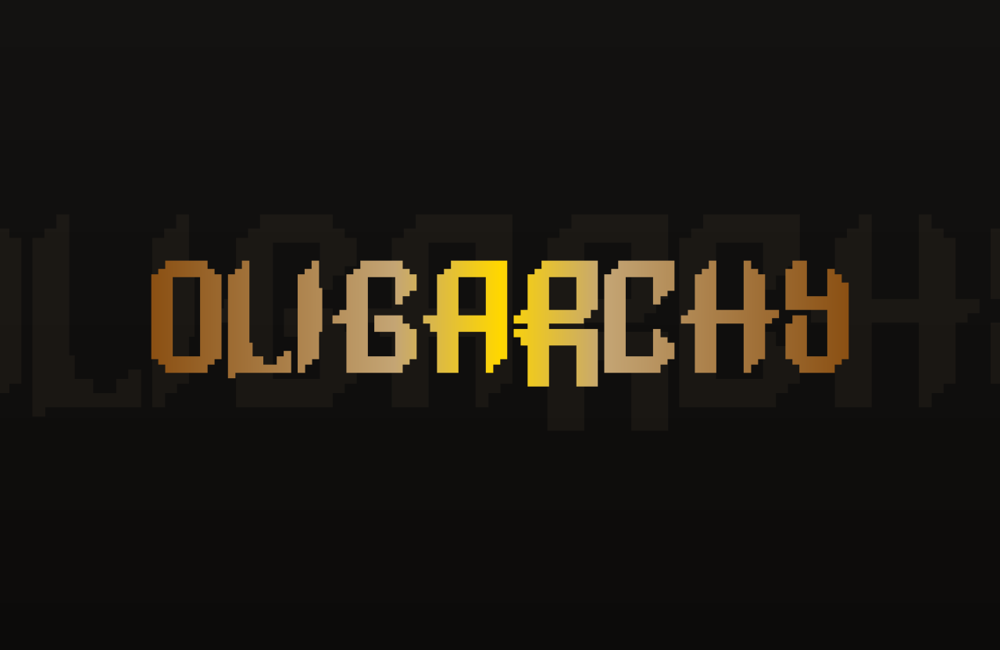
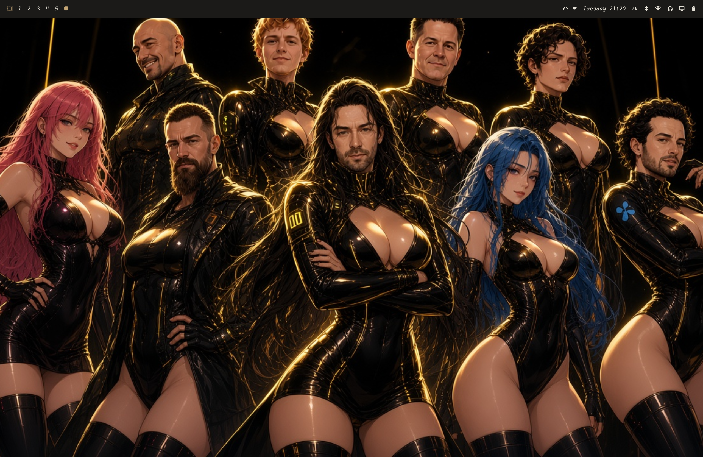

# Oligarchy

Champagne-gold Omarchy theme: charcoal silk backgrounds, pearl text, vibrant amber window borders, and matching Neovim / Quickshell chrome.

<p align="center">
  
</p>

<p align="center">
  
</p>

## Install

```bash
omarchy theme install https://github.com/Foparty/fo-oligarchy
# or: clone/copy into ~/.config/omarchy/themes/oligarchy
omarchy theme set oligarchy
```

That alone gives you palette, wallpapers, Hyprland gold border, Neovim (aether), and shell bar/control gold tokens.

## Bar extras (gold logo + focused workspace)

Theme install does **not** auto-wire custom bar widgets. Run:

```bash
~/.config/omarchy/themes/oligarchy/extras/install-bar-extras.sh
omarchy restart shell   # if the bar did not hot-reload
```

This installs:

| Plugin | Effect |
|--------|--------|
| `oligarchy.menu` | Omarchy logo always uses theme `accent` gold |
| `oligarchy.workspaces` | Focused workspace uses gold |

Ids are stable (`oligarchy.*`), not username-prefixed, so they work for anyone.

## Optional: spinning border + translucent terminals

Hyprland’s `borderangle` loop can stall on translucent compositor opacity. Oligarchy’s recommended setup:

1. Keep terminals **opaque to Hyprland** (snippet):  
   [`extras/looknfeel-terminals.lua.snippet`](extras/looknfeel-terminals.lua.snippet) → add to `~/.config/hypr/looknfeel.lua`
2. Keep the **glass look in Kitty**:  
   [`extras/kitty-opacity.conf.snippet`](extras/kitty-opacity.conf.snippet) → add to `~/.config/kitty/kitty.conf`
3. Reload: `hyprctl reload` and open a new Kitty window

Border animation + colors live in the theme’s [`hyprland.lua`](hyprland.lua) (applied on `omarchy theme set`).

## What’s in this theme

| File | Role |
|------|------|
| `colors.toml` | Shared palette (`accent` = champagne gold) |
| `hyprland.lua` | Multi-stop gold gradient + `borderangle` loop |
| `neovim.lua` | aether colorscheme wired to this palette |
| `shell.bar.toml` / `shell.controls.toml` | Quickshell gold attention / control chrome |
| `backgrounds/` | Wallpapers |
| `extras/plugins/` | Gold logo + workspaces bar widgets |
| `extras/install-bar-extras.sh` | Installs those widgets into your Omarchy config |

## After editing theme files

Always re-apply so Hyprland/shell pick up state copies:

```bash
omarchy theme set oligarchy
```

## Notes

- Do **not** copy someone else’s full `~/.config/omarchy/shell.json` — it would overwrite your bar layout. Use the install script instead.
- Switching away from Oligarchy keeps `oligarchy.*` plugins installed; re-enable `omarchy.menu` / `omarchy.workspaces` if you want stock widgets back, or leave the gold variants (they follow each theme’s `accent`).
